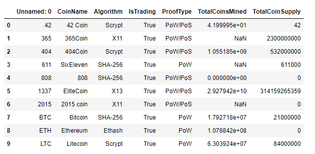

# Cryptocurrencies

### Overview of the Analysis
The purpose of this project was to work with a prominent investment bank, who is interested in offering an new investment portfolio involving cryptocurrencies. We are asked to help them create a report that includes what cryptocurrencies are on the trading market and how they could be grouped to create a classification system for this new investment.

We used unsupervised learning for our analysis. We used the following approach:
- Preprocessing the Data for PCA
- Reducing Data Dimensions Using PCA
- Clustering Cryptocurrencies Using K-means
- Visualizing Cryptocurrencies Results

## Results

#### Preprocessing the Data for PCA

After importing our data we had 1252 rows and 7 columns: 

We cleaned the data by dropping null values and removing columns.

We then standardized the data with StandardScaler to put it in a structured format:

####  Reducing Data Dimensions Using PCA

We used PCA to reduce dimension to three principal components and created the following DataFrame:

####  Clustering Cryptocurrencies Using K-Means

Using K-means method, we produced the elbow curve below. WE used the Elbow Rule to determine which was the appropriate number of clusters to classify the data. In our case that was K=4.

We ran K-Means algorithm to make predictions of the K clusters, initialized the K-Means model, fit the model and predicted the clusters.

A new DataFrame was created including predicted clusters and cryptocurrencies features:

####  Visualizing Cryptocurrencies Results

We created a 3D-Scatter with the PCA data and the clusters

We created a table with tradable cryptocurrencies using the hvplot.table() function. There are 532 tradeable cryptocurrencies.

We created a new DataFrame that had the scaled data with the clustered_df DataFrame index

We created a scatterplot using using x="TotalCoinsMined" and y="TotalCoinSupply"

### Summary

Based on the 3D PCA scatter plot, most of the cryptocurrencies are part of class 0, and only one in class 1 (BitTorrent), only one in class 2(TurtleCoin)and several in class 3 (EliteCoin, MoonCoin, ByteCoin, gCn Coin, Newton Coin, Qwertycoin). This is confirmed using the Tradable Cryptocurrencies table.